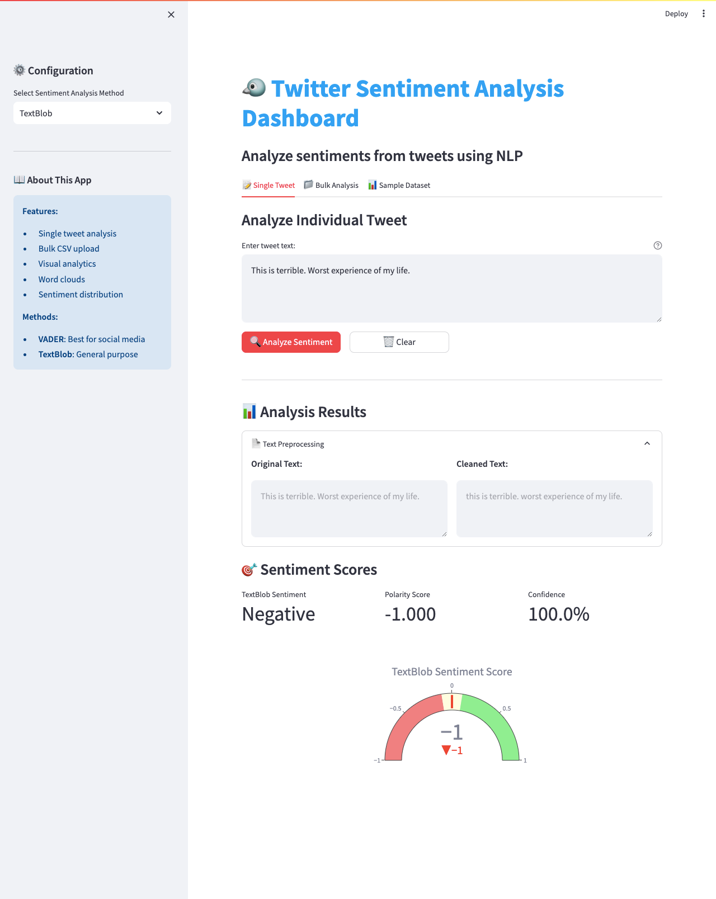

# 🐦 Twitter Sentiment Analysis Dashboard

A comprehensive web application for analyzing sentiment in tweets using Natural Language Processing (NLP) techniques.


## 📸 Demo



*Real-time sentiment analysis with interactive visualizations*

## 🔗 Live Demo

🌐 **[Try the app live here](https://your-app-url.streamlit.app)** *(Replace with your actual Streamlit Cloud URL)*

---

## 📋 Project Overview

This project analyzes sentiments from tweets using two popular NLP methods:
- **TextBlob**: Pattern-based sentiment analysis
- **VADER**: Specially designed for social media sentiment analysis

The application provides an intuitive interface for both individual tweet analysis and bulk processing of multiple tweets, complete with visual analytics and exportable results.

## ✨ Features

### Core Functionality
- **Single Tweet Analysis**: Analyze individual tweets in real-time with instant results
- **Bulk CSV Upload**: Process hundreds of tweets simultaneously
- **Dual Analysis Methods**: Compare TextBlob and VADER side-by-side
- **Sample Dataset**: Try the app with pre-loaded example tweets

### Visual Analytics
- 📊 Interactive gauge charts for sentiment scores
- 🥧 Sentiment distribution pie charts
- 📈 Bar charts for sentiment counts
- ☁️ Word clouds for visual text analysis
- 🎨 Color-coded sentiment indicators

### Data Processing
- 🧹 Automatic text preprocessing (removes URLs, mentions, hashtags)
- 📥 CSV upload support
- 📤 Export analyzed results as CSV
- 🔄 Real-time analysis

## 🛠️ Technologies Used

| Category | Technologies |
|----------|-------------|
| **Language** | Python 3.11+ |
| **Web Framework** | Streamlit |
| **NLP Libraries** | TextBlob, VADER Sentiment, NLTK |
| **Data Processing** | Pandas, NumPy |
| **Visualization** | Plotly, Matplotlib, Seaborn, WordCloud |
| **Deployment** | Streamlit Cloud |

## 📦 Installation

### Prerequisites
- Python 3.11 or higher
- pip package manager
- Git

### 1. Clone the repository
```bash
git clone https://github.com/priyanka7411/Twitter-Sentiment-Analysis.git
cd Twitter-Sentiment-Analysis
```

### 2. Create virtual environment
```bash
# On Mac/Linux
python3 -m venv venv
source venv/bin/activate

# On Windows
python -m venv venv
venv\Scripts\activate
```

### 3. Install dependencies
```bash
pip install -r requirements.txt
```

### 4. Download NLTK data
```bash
python3 -c "import nltk; nltk.download('punkt'); nltk.download('stopwords'); nltk.download('vader_lexicon')"
```

## 🚀 Usage

### Running Locally

1. Activate your virtual environment
```bash
source venv/bin/activate  # Mac/Linux
```

2. Run the Streamlit app
```bash
streamlit run app.py
```

3. Open your browser and navigate to `http://localhost:8501`

### Using the Application

#### Single Tweet Analysis
1. Navigate to the **"📝 Single Tweet"** tab
2. Enter your tweet text in the text area
3. Select analysis method:
   - **TextBlob**: General purpose sentiment analysis
   - **VADER**: Optimized for social media
   - **Both**: Compare results from both methods
4. Click **"🔍 Analyze Sentiment"**
5. View results with sentiment label, score, and confidence

#### Bulk Analysis
1. Navigate to the **"📁 Bulk Analysis"** tab
2. Prepare a CSV file with a column named `text` or `tweet`
3. Click **"Choose a CSV file"** and upload your file
4. Click **"🚀 Start Analysis"**
5. Explore visualizations:
   - Sentiment distribution pie chart
   - Sentiment count bar chart
   - Word cloud (filter by sentiment)
6. Download results using **"📥 Download Results as CSV"**

#### Sample Dataset
1. Navigate to the **"📊 Sample Dataset"** tab
2. Click **"🎲 Generate Sample Data"**
3. Explore pre-loaded examples with automatic analysis

## 📂 Project Structure
```
Project1_Twitter_Sentiment/
│
├── app.py                      # Main Streamlit application
├── setup.py                    # NLTK data download script
├── requirements.txt            # Python dependencies
├── packages.txt                # System packages for deployment
├── README.md                   # Project documentation
├── .gitignore                  # Git ignore file
│
├── .streamlit/
│   └── config.toml            # Streamlit configuration
│
├── images/
│   └── dashboard_preview.png  # Screenshot for README
│
├── data/
│   └── sample_tweets.csv      # Sample data file
│
├── notebooks/                  # Jupyter notebooks (for analysis)
├── models/                     # Saved models (if any)
└── venv/                       # Virtual environment
```

## 🎯 Key Learnings

Throughout this project, I gained hands-on experience with:

- ✅ **Natural Language Processing**: Understanding sentiment analysis algorithms
- ✅ **Text Preprocessing**: Cleaning and preparing text data for analysis
- ✅ **Multiple NLP Libraries**: Working with TextBlob, VADER, and NLTK
- ✅ **Web Development**: Building interactive applications with Streamlit
- ✅ **Data Visualization**: Creating meaningful charts with Plotly
- ✅ **File Processing**: Handling CSV uploads and data export
- ✅ **Cloud Deployment**: Deploying applications on Streamlit Cloud
- ✅ **Version Control**: Managing code with Git and GitHub

## 📊 How It Works

### Sentiment Analysis Methods

#### TextBlob
- Uses pattern-based approach
- Polarity score ranges from -1 (negative) to +1 (positive)
- Simple and effective for general text
- Threshold: > 0.1 (Positive), < -0.1 (Negative), else Neutral

#### VADER (Valence Aware Dictionary and sEntiment Reasoner)
- Specifically designed for social media text
- Considers emoticons, slang, and intensity
- Compound score ranges from -1 to +1
- Threshold: ≥ 0.05 (Positive), ≤ -0.05 (Negative), else Neutral

### Text Preprocessing Pipeline
1. Convert text to lowercase
2. Remove URLs (http, https, www)
3. Remove user mentions (@username)
4. Remove hashtag symbols (keep the word)
5. Remove extra whitespace
6. Return cleaned text

## 🔮 Future Enhancements

Planned improvements for future versions:

- [ ] **Real-time Twitter API Integration**: Fetch live tweets
- [ ] **Multi-language Support**: Analyze tweets in different languages
- [ ] **Historical Analysis**: Track sentiment trends over time
- [ ] **Deep Learning Models**: Implement BERT/RoBERTa for better accuracy
- [ ] **User Authentication**: Save analysis history
- [ ] **Emoji Analysis**: Better handling of emoji sentiment
- [ ] **Export Options**: PDF reports, Excel files
- [ ] **API Endpoint**: RESTful API for programmatic access
- [ ] **Batch Processing**: Handle larger datasets
- [ ] **Custom Models**: Train domain-specific sentiment models

## 🎓 Use Cases

This application can be used for:

- 📱 **Social Media Monitoring**: Track brand sentiment
- 🛍️ **Product Reviews**: Analyze customer feedback
- 📰 **News Analysis**: Gauge public opinion on topics
- 🎬 **Entertainment**: Movie/show review sentiment
- 🏢 **Business Intelligence**: Customer satisfaction tracking
- 🎓 **Research**: Academic sentiment analysis studies
- 📊 **Marketing**: Campaign effectiveness measurement

## 👩‍💻 Author

**Priyanka Malavade**
- 🎓 BCA Graduate 2024
- 📊 Data Science Enthusiast
- 📧 [Your Email] *(priyasmalavade@gmail.com)*
- 💼 [LinkedIn Profile] *(https://www.linkedin.com/in/priyanka-malavade-b34677298/)*
- 🐙 [GitHub Profile] *(https://github.com/priyanka7411)*

## 📄 License

This project is licensed under the MIT License - feel free to use it for learning and portfolio purposes.

## 🙏 Acknowledgments

- **GUVI** - Data Science Course and guidance
- **TextBlob Documentation** - NLP implementation reference
- **VADER Sentiment** - Social media sentiment analysis tool
- **Streamlit Community** - Amazing web framework
- **Plotly** - Interactive visualization library
- **Stack Overflow Community** - Problem-solving support

## 📞 Contact & Feedback

Found a bug? Have suggestions? Want to contribute?

- 🐛 [Open an issue](https://github.com/priyanka7411/Twitter-Sentiment-Analysis/issues)
- 💡 [Submit a feature request](https://github.com/priyanka7411/Twitter-Sentiment-Analysis/issues)
- ⭐ Star this repository if you found it helpful!

---

<div align="center">

**⭐ If you found this project helpful, please give it a star! ⭐**

Made with ❤️ by Priyanka 
[⬆ Back to Top](#-twitter-sentiment-analysis-dashboard)

</div>